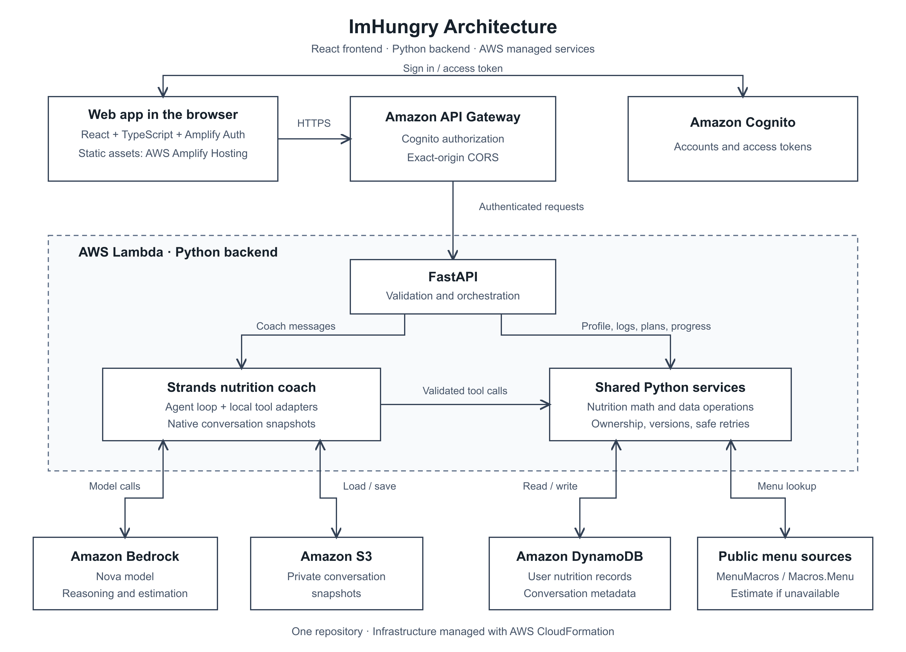

# ImHungry

Full-stack AI nutrition coach with a React/TypeScript frontend and a Python 3.12
FastAPI backend in this repository. The backend uses one Strands dietitian agent,
Bedrock, DynamoDB product records and native Strands S3 conversation snapshots.

**Open the app:** https://main.d2sqqpgd3gb3c4.amplifyapp.com

The React frontend lives in [frontend/](frontend/README.md), uses Amplify Auth
with the existing Cognito pool, and is hosted on AWS Amplify. Create an account,
verify your email and start with Setup. Its short implementation checklist is in
[FRONTEND_IMPLEMENTATION.md](FRONTEND_IMPLEMENTATION.md).

The four feature groups are defined in [FEATURES.md](FEATURES.md). The completed
audit, feature/service/tool/endpoint/test matrix and staged implementation plan
are in [IMPLEMENTATION.md](IMPLEMENTATION.md). Persistence and interfaces are
documented in [SCHEMA.md](SCHEMA.md) and [ToolsAndEndpoints.md](ToolsAndEndpoints.md).

## Run the frontend locally

```bash
npm ci --prefix frontend
npm run dev --prefix frontend
```

Open http://127.0.0.1:5173. The frontend connects to the deployed backend and uses
your Cognito account. See the [frontend guide](frontend/README.md) for configuration,
tests and publishing commands.

## Run the backend demo locally without AWS

```bash
uv sync
UV_CACHE_DIR=/tmp/imhungry-uv-cache uv run pytest -q
uv run imhungry --demo
```

The offline demo uses a clearly labeled scripted model, the real Strands tool
loop, memory repositories and native in-memory snapshots. Try `hello`,
`log demo yogurt`, then `what should I eat for dinner?`. The demo yogurt has
explicit fixture values of 150 kcal, 20 g protein, 10 g carbohydrates and 3 g fat;
these are test data, not a nutrition lookup. Data is discarded when the CLI exits.

```bash
uv run imhungry --demo --message "What should I eat for dinner?"
```

With existing authorized Bedrock access, `uv run imhungry --local` uses the real
model with ephemeral local data. This CLI is a local development harness with a
fixed local identity; it cannot access production DynamoDB or S3. There is no
development identity override in the production HTTP application.

## AWS deployment and HTTP backend

The CloudFormation templates in [infra](infra/README.md) provision the app storage,
Cognito identities, Lambda backend and API Gateway. The deployment guide includes
repeatable build, validation and change-set commands. [Current deployment](infra/DEPLOYMENT.md)
records the live endpoint, identifiers and verification. To run the HTTP server locally
against those resources, configure these non-secret environment settings:

| Setting | Purpose |
| --- | --- |
| `IMHUNGRY_TABLE` | Existing DynamoDB table with string PK/SK and sparse GSI1 |
| `IMHUNGRY_BUCKET` | Existing private S3 snapshot bucket |
| `IMHUNGRY_ENV` | Storage namespace, default `dev`; lowercase letters/digits/hyphens |
| `COGNITO_ISSUER` | `https://cognito-idp.<region>.amazonaws.com/<pool-id>` |
| `COGNITO_CLIENT_ID` | Allowed Cognito app client |
| `AWS_REGION` | AWS region, default `us-west-2` |
| `STRANDS_MODEL_ID` | Default `global.amazon.nova-2-lite-v1:0` |
| `STRANDS_MAX_TOKENS` | Per-model-call output cap, default 3000 |
| `IMHUNGRY_CORS_ORIGINS` | Comma-separated browser origins; for local Vite use `http://127.0.0.1:5173` |

```bash
uv run uvicorn imhungry.runtime:app_factory --factory --host 127.0.0.1 --port 8000
```

Startup fails if required settings are absent. `/health` is unauthenticated and
does not invoke a model. Browser OPTIONS preflight is public; product requests
on every `/v1` route require a Cognito access token in the
Authorization Bearer header. Verification checks RS256 signature, issuer,
expiry, issue time, token purpose, app client and UUID subject. The server never
trusts a user ID header or body field. Sign-in remains a Cognito/client concern;
the backend has no password or login endpoint. It does not print tokens or
request bodies. Debug wire logging should remain disabled.

Create requests require an `Idempotency-Key` header. A message may instead use
`client_request_id`. Identical retries return the completed original response;
changing the payload under the same key returns 409. Patches and deletes require
`If-Match` with the last resource version. Creating the initial profile uses
`If-Match: 0`. Lists return `items` and `next_cursor`. Date ranges are inclusive
local dates, at most 366 days. A missing profile defaults date interpretation to
UTC until the user configures a timezone; physical inputs are never invented.

The HTTP interface includes profile and strategy calculation/history, intake
CRUD and summaries, recipes, saved/frequent foods, hydration, accepted meal plans,
check-ins, progress and confirmed behavior patterns. Conversation create/list/
rename/archive/delete, text projection and message invocation use `/v1/conversations`.
For local contract inspection without running AWS, call `create_app` with injected
services and inspect `app.openapi()`; interactive API docs are not exposed publicly.

## Architecture and semantics



[Editable diagram (SVG)](docs/architecture.svg) · [Architecture details](ARCHITECTURE.md)

FastAPI routes and 34 local `@tool(context=True)` adapters call the same
`NutritionService`. Trusted invocation state supplies the verified Cognito subject,
services, conversation and request identity. The model cannot choose storage keys
or another user. All DynamoDB queries are partition-scoped, paginated and key-based.
Conditional transactions protect updates, date-key moves and mutation receipts.

Strategies form an append-only effective timeline, with no plan ID. Calculated
strategies are revalidated against the current profile on save. Manual target
choices explicitly use `user_provided` calculation provenance. The implementation
uses the [Mifflin-St Jeor equation](https://pubmed.ncbi.nlm.nih.gov/2305711/),
self-reported activity multipliers and an explicitly approximate energy-to-weight
conversion. Automated calculations are bounded adult estimates, not clinical
prescriptions. Recipe arithmetic and logged totals are deterministic. Unlogged
days remain unknown consumption, and unknown fiber/sodium are not invented zeros.

Suggestions and coaching are generated through the conversation endpoint.
Only accepted meal decisions and confirmed behavior patterns become canonical
records. Planned-meal completion does not log food automatically. Recipe or
saved-food edits do not rewrite previously logged nutrition snapshots. One
balanced explicit response style is implemented; the presentation preference is
stored for a future low-obsession experience.

Strands 1.55.1 is pinned. Conversation ownership is checked before restoring a
snapshot. A stable `dietitian` agent ID and native SnapshotSessionManager preserve:

```text
imhungry/<environment>/session/<conversation-id>/scopes/agent/dietitian/snapshots/snapshot_latest.json
```

The manager saves explicitly after a successful invocation using its native API;
no custom transcript schema or immutable per-turn objects are introduced. Message
reads project only user and assistant text, never raw snapshots, tool payloads or
agent state. The current trusted prompt/date is refreshed after restoration.

## Testing

```bash
UV_CACHE_DIR=/tmp/imhungry-uv-cache uv run pytest -q
npm test --prefix frontend
npm run build --prefix frontend
git diff --check
```

The build includes TypeScript checking; no separate lint command is configured.
The 2026-09-15 review passed 93 backend and 20 frontend tests. Frontend tests cover
API/auth handling, Markdown rendering, US units, date ranges, profile clearing,
food replacement and stable retries. See [review results](IMPLEMENTATION.md) for
local browser checks and remaining verification limits. These changes require an
explicit publication to reach AWS; a Git push alone does not deploy them.

Tests use Moto for DynamoDB/S3, local public-key verification fixtures and injected
model responses. They do not call real AWS. Conversation tests execute the actual
Strands loop through both tool and no-tool turns, persist/restore native snapshots,
log food and use intake/profile context in the next response. This verifies
integration behavior, not the reasoning quality of a live Bedrock model. One
upstream Starlette/AnyIO deprecation warning may appear.

## Limitations and operation

- A public menu adapter now tries MenuMacros chain pages and the Macros.Menu
  HTTPS URL-analysis proxy. It preserves source URLs and only accepts complete
  calorie/protein/carbohydrate/fat groups. If retrieval fails, the restaurant
  tool returns a structured instruction to estimate from the user's menu item
  and portion. This is deliberately conservative because third-party pages can
  be stale or estimated; the agent should recommend checking official restaurant
  nutrition pages for current values and allergies. General food lookup still
  needs a selected database provider. Bedrock structured estimation is
  implemented, injectable and locally tested. The configured model passed a live
  invocation check; authenticated estimation through the deployed API is still
  unverified. Restaurant discovery remains a stretch goal.
- Deployment uses the resources and scoped runtime permissions described in
  [infra/README.md](infra/README.md). The frontend uses Cognito SDK sign-in and
  exact-origin CORS; it does not require an OAuth callback or hosted login domain.
- Snapshot and DynamoDB commits cannot be one atomic transaction. Conversation
  locks do not expire automatically: a failed or abandoned turn remains blocked
  instead of risking duplicate tool writes or overwriting a newer snapshot.
  Other conversations and ordinary resource routes remain available.
- Operator recovery is intentionally not an HTTP/model tool. Stop the original
  invocation process, inspect the owned metadata, completed receipt, latest
  snapshot and any committed tool mutations; resolve the partial result before
  conditionally clearing the matching lock/version. Never clear a lock solely
  because enough time elapsed, and never replay a failed turn as a fresh request
  without reconciling writes. Authorized AWS access is required for this work.
- Deletion removes the snapshot and conversation response receipts before
  metadata; a partial deletion stays locked for recovery. Independent food,
  profile and coaching records are not deleted with a conversation.
- Lists initially read the selected user's matching collection before slicing
  cursor pages. Cursors are bound to user/query but concurrent edits can shift
  offsets. Large histories may require storage-native pagination, a receipt
  retention policy and measured aggregate caching; none is silently approximated.
- Nutrition calculation bounds and coaching language need product/clinical review
  before broader use. See the deployment report for live verification results.
  No mobile, notifications, workouts, images, MCP, RAG or multi-agent
  system was added.
